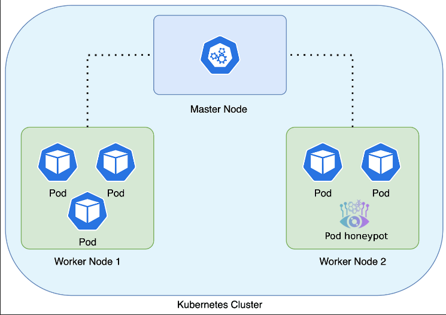

# Kubernetes deployment

Requirements:

1. kubectl installed and context configured [https://kubernetes.io/docs/tasks/tools/install-kubectl/](https://kubernetes.io/docs/tasks/tools/install-kubectl/)
2. helm installed [https://helm.sh/docs/intro/quickstart/](https://helm.sh/docs/intro/quickstart/)

**Below are the commands to download, configure and deploy Beelzebub.**

1. Clone Beelzebub repository:

```
$ git clone https://github.com/mariocandela/beelzebub.git
```

2. You can rewrite the chart [default values](https://github.com/mariocandela/beelzebub/blob/main/beelzebub-chart/values.yaml) with a `custom-values.yaml`&#x20;

Follow example of `custom-values.yaml`

```
image:
  repository: m4r10/beelzebub
  pullPolicy: IfNotPresent
  tag: v3.0.0

beelsebubServiceConfigs: |
  apiVersion: "v1"
  protocol: "ssh"
  address: ":2222"
  description: "SSH interactive"
  commands:
    - regex: "^ls$"
      handler: "Documents Images  Desktop Downloads .m2 .kube .ssh  .docker"
    - regex: "^pwd$"
      handler: "/home/"
    - regex: "^uname -m$"
      handler: "x86_64"
    - regex: "^docker ps$"
      handler: "CONTAINER ID   IMAGE     COMMAND   CREATED   STATUS    PORTS     NAMES"
    - regex: "^docker .*$"
      handler: "Error response from daemon: dial unix docker.raw.sock: connect: connection refused"
    - regex: "^uname$"
      handler: "Linux"
    - regex: "^ps$"
      handler: "  PID TTY           TIME CMD\n21642 ttys000    0:00.07 /bin/dockerd"
    - regex: "^(.+)$"
      handler: "command not found"
  serverVersion: "OpenSSH"
  serverName: "ubuntu"
  passwordRegex: "^(root|qwerty|Smoker666|123456|jenkins|minecraft|sinus|alex|postgres|Ly123456)$"
  deadlineTimeoutSeconds: 60

service:
  type: ClusterIP
  port: 2222
```

Deploy:

```
$ helm install beelzebub ./beelzebub-chart
```

Deploy using custom values:

```
$ helm install beelzebub ./beelzebub-chart -f custom-values.yaml
```


<figure><figcaption></figcaption></figure>
